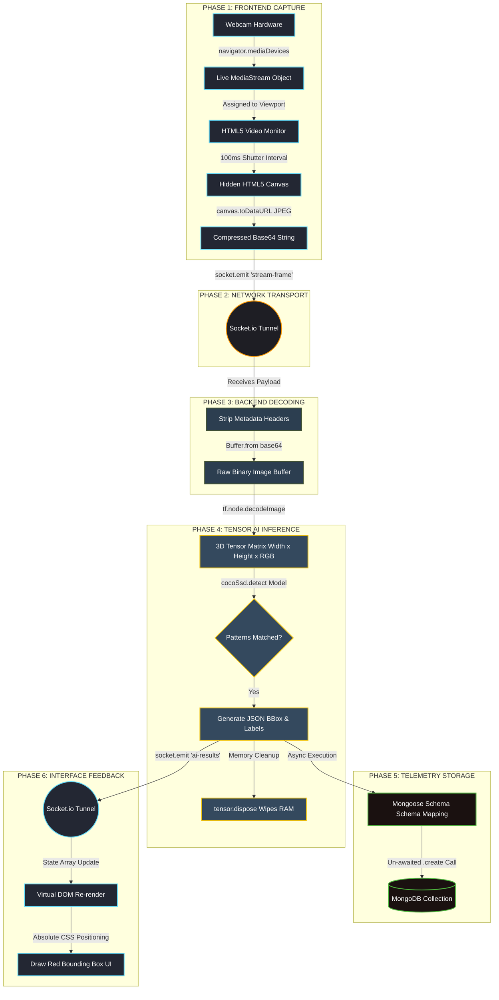

# Architectural Workflow & System Execution Phases

This reference guide details the step-by-step processing mechanics of the real-time AI computer vision streaming stack. It maps how a physical webcam video frame is converted into numerical data and recorded inside the database.

---

## 📊 Visual System Flowcharts

### 1. Interactive Mermaid.js Flowchart
*(This flowchart will automatically render as a visual diagram in GitHub, GitLab, VS Code, or any Markdown viewer that supports Mermaid).*



---

### 2. Structured Text Visual Flowchart
*(A universal fallback flowchart that displays perfectly across all devices and code editors without requiring special extension support).*

```text
========================================================================================
                                 SYSTEM PIPELINE FLOWCHART
========================================================================================

 [ CLIENT / FRONTEND ]
  ┌─────────────────────────┐
  │ Webcam Hardware Boot    │
  └────────────┬────────────┘
               ▼
  ┌─────────────────────────┐
  │ Live MediaStream Object │ ──► [ Renders Visible Web Player <video> ]
  └────────────┬────────────┘
               ▼
  ┌─────────────────────────┐
  │ Hidden Canvas Shutter   │ ──► [ Takes Capture Snapshots Every 100ms (10 FPS) ]
  └────────────┬────────────┘
               ▼
  ┌─────────────────────────┐
  │ Base64 Text Conversion  │ ──► [ Compresses Frame Image Array to JPEG String ]
  └────────────┬────────────┘
               │
               ▼  [ TRANSPORTATION LAYER: Socket.io Persistent Network Pipe ]
       =========================================================================
               │
 [ SERVER / BACKEND ]
               ▼
  ┌─────────────────────────┐
  │ Data Header Stripper    │ ──► [ Removes Base64 Typing Context Wrappers ]
  └────────────┬────────────┘
               ▼
  ┌─────────────────────────┐
  │ Binary Buffer Engine    │ ──► [ Maps Compressed Text Elements Back to Image Bits ]
  └────────────┬────────────┘
               ▼
  ┌─────────────────────────┐
  │ TensorFlow JS Model     │ ──► [ Transforms Image Chunks into a 3D Tensor Matrix ]
  └────────────┬────────────┘
               ▼
  ┌─────────────────────────┐
  │ AI Neural Detection     │ ──► [ coco-ssd Scans Array for Shapes & Silhouettes ]
  └────────────┬────────────┘
               │
               ├─────────────────────────────────────────┐
               ▼ [ PARALLEL STORAGE LAYER ]              ▼ [ PARALLEL DISPLAY LAYER ]
  ┌─────────────────────────┐               ┌─────────────────────────┐
  │ Mongoose Analytics Map  │               │ Socket Packet Return    │
  └────────────┬────────────┘               └────────────┬────────────┘
               ▼ (Fire-and-Forget Async)                 ▼ (WebSocket Pipeline Tunnel)
  ┌─────────────────────────┐               ┌─────────────────────────┐
  │ MongoDB Database Log    │               │ React Hooks Sync        │
  └─────────────────────────┘               └────────────┬────────────┘
                                                         ▼
                                            ┌─────────────────────────┐
                                            │ CSS Absolute Red BBox   │
                                            │ UI Rendering Component  │
                                            └─────────────────────────┘

========================================================================================
```

---

## 🛠️ System Execution Breakdown

### Phase 1: Frontend Capture & Frame Isolation
* **Hardware Registration:** The client requests immediate hardware permission using the browser-native `navigator.mediaDevices.getUserMedia()` implementation.
* **Canvas Interception:** While the visible stream prints smoothly inside an HTML `<video>` monitor element, a hidden `<canvas>` frame buffer tracks it in parallel.
* **Granular Extraction Rate:** An engine interval triggers every 100ms. It commands the canvas context layout to lock onto the current visual matrix index and print a compressed snapshot slice.
* **Encoding Packing:** The layout slice is compressed as an optimized JPEG and serialized directly into an exportable Base64 alphanumeric text string.

### Phase 2: Transportation Pipeline (Socket Network Engine)
* **Persistent Signaling Handshake:** During initial app bootstrap, a state connection handshakes over TCP to open a persistent **WebSockets (Socket.io)** bi-directional lane.
* **Zero Request Header Overhead:** To prevent the massive browser header overhead caused by standard RESTful HTTP requests (`fetch`/`axios`), data drops down the raw WebSockets stream using a simple `socket.emit("stream-frame")` push operation.
* **High Throughput Delivery:** Frames reach server memory registers in under 15ms.

### Phase 3: Node.js Data Reconstruction
* **Header Stripping Parsing:** Node.js catches the string inside the pipeline lane and strips away the string data typing metadata wrappers (e.g., `data:image/jpeg;base64,`).
* **Binary Buffer Allocation:** The engine executes a rapid memory allocation step via `Buffer.from(data, "base64")` to convert the alphanumeric stream back into raw image bits.

### Phase 4: Tensor Machine Learning Pipeline (Local Inference)
* **Matrix Translation:** The binary buffer data passes into `tf.node.decodeImage(buffer, 3)`. TensorFlow transforms the file system elements into a **3D Tensor Matrix** (Width × Height × RGB Color Depth Map).
* **Deep Neural Evaluation:** The mathematical tensor drops straight down into the localized pre-compiled object schema model mapping engine (`coco-ssd`). The machine scans structural slopes, edges, patterns, and contours.
* **Heap Memory Disposal:** The engine calls `tensor.dispose()` right away. This wipes out the pixel vector stack from standard RAM limits, preventing server execution node leaks.

### Phase 5: Telemetry Storage Pipeline (MongoDB Logging)
* **Async Dispatching Process:** Once classifications are derived, data objects map to a Mongoose analytics tracker blueprint model configuration schema.
* **Fire-and-Forget Database Write:** The database engine executes an un-awaited `DetectionLog.create()` database creation transaction. Running this step outside the critical server loop prevents storage I/O delay bottlenecks on the stream.

### Phase 6: Interface Overlay Drawing Loop
* **Payload Serialization Return:** Node.js outputs the final calculations (`bbox` coordinates array, labeling classification text, confidence level ratio) back down the WebSocket tunnel via `socket.emit("ai-results")`.
* **Dynamic Hook Remapping:** The React state system hooks into the array message and forces a structural virtual DOM layout recalculation.
* **CSS Boundary Overlay Paint:** The screen renders dynamic HTML `<div>` border elements with absolute coordinates (`left`, `top`, `width`, `height`) exactly matched to the object location, refreshing up to 10 times per second.
