# UML Diagrams — Aura Health

Eight UML views of the platform described in the root [README](../README.md) and [PROJECT_STRUCTURE.md](PROJECT_STRUCTURE.md). Those two documents cover the system architecture, module layering, and several sequence flows already — this document is the dedicated UML set: use case, activity, sequence, class, component, deployment, communication, and object diagrams, each modeling the real routes, services, and Mongoose schemas in `Backend/`.

> **Notation note:** Mermaid (the renderer used here) only has native syntax for `classDiagram`, `sequenceDiagram`, `erDiagram`, `stateDiagram`, and `flowchart`. It has no built-in use case, component, deployment, or communication diagram type, so those four are drawn with `flowchart` shapes chosen to match standard UML notation as closely as possible (ellipses for use cases, boxed components with connectors, nested boxes for deployment nodes, numbered links for communication). The class, sequence, and object diagrams use Mermaid's native, fully-compliant syntax.

## Contents

1. [Use Case Diagram](#1-use-case-diagram)
2. [Activity Diagram](#2-activity-diagram)
3. [Sequence Diagram](#3-sequence-diagram)
4. [Class Diagram](#4-class-diagram)
5. [Component Diagram](#5-component-diagram)
6. [Deployment Diagram](#6-deployment-diagram)
7. [Communication Diagram](#7-communication-diagram)
8. [Object Diagram](#8-object-diagram)

---

## 1. Use Case Diagram

Three human actors — Patient, Doctor, Admin — plus three external systems (Gemini, Cloudinary, SMTP) that participate directly in certain use cases. `Book Appointment` includes both booking paths (`appointrouter.js` exposes both the legacy request flow and the newer slot-based flow, per the ER/module-layering diagrams in the README); registration and password reset both include OTP verification, backed by the TTL-expiring `otps` and `pendingusers` collections.

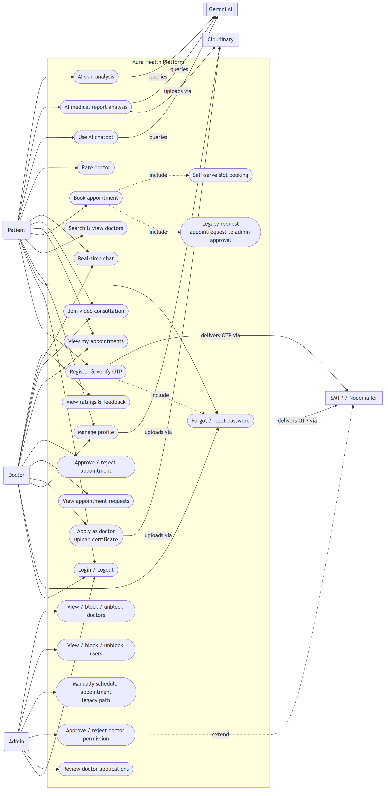

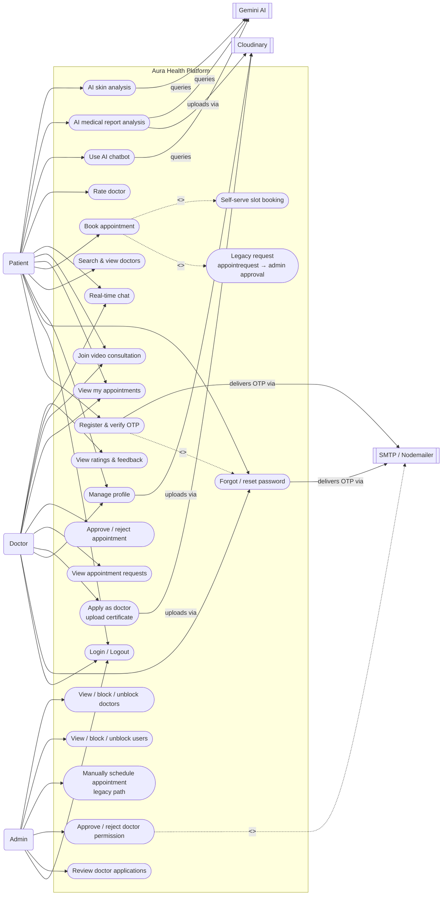

---

## 2. Activity Diagram

The patient-facing journey from authentication through appointment booking to consultation — the workflow that touches the most decision points and both booking paths at once (legacy admin-approved vs. self-serve slots), converging on the fork where a confirmed appointment simultaneously unlocks chat and video.

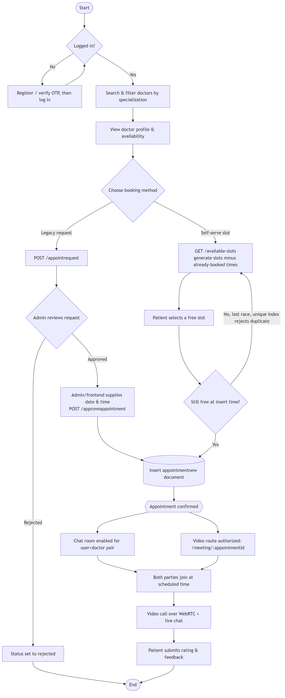

```mermaid
flowchart TD
    Start([Start]) --> Login{Logged in?}
    Login -->|No| Auth[Register / verify OTP, then log in]
    Auth --> Login
    Login -->|Yes| Search[Search & filter doctors by specialization]
    Search --> ViewProfile[View doctor profile & availability]
    ViewProfile --> Choice{Choose booking method}

    Choice -->|Legacy request| Submit[POST /appointrequest]
    Submit --> AdminDecision{Admin reviews request}
    AdminDecision -->|Rejected| Reject[Status set to rejected]
    Reject --> End([End])
    AdminDecision -->|Approved| Manual[Admin/frontend supplies date & time<br/>POST /approveappointment]
    Manual --> Persist[(Insert appointmentnew document)]

    Choice -->|Self-serve slot| Slots[GET /available-slots<br/>generate slots minus already-booked times]
    Slots --> Pick[Patient selects a free slot]
    Pick --> Recheck{Still free at insert time?}
    Recheck -->|No — lost race<br/>unique index rejects duplicate| Slots
    Recheck -->|Yes| Persist

    Persist --> Fork{{Appointment confirmed}}
    Fork --> ChatOn[Chat room enabled for user+doctor pair]
    Fork --> MeetOn[/meeting/:appointmentId authorized]
    ChatOn --> Join[Both parties join at scheduled time]
    MeetOn --> Join
    Join --> Consult[Video call over WebRTC + live chat]
    Consult --> Rate[Patient submits rating & feedback]
    Rate --> End
```

---

## 3. Sequence Diagram

Self-serve slot booking traced through the actual layers (`appointrouter.js` → `appointmentcontroller.js` → `service/appointment.js` → `appointmentnew` collection), including the double-booking race that the compound unique index (`{doctorid, date, time}`) is specifically there to catch — noted in the README's reliability section and confirmed in [appointment.js](../Backend/model/Appointment/appointment.js).

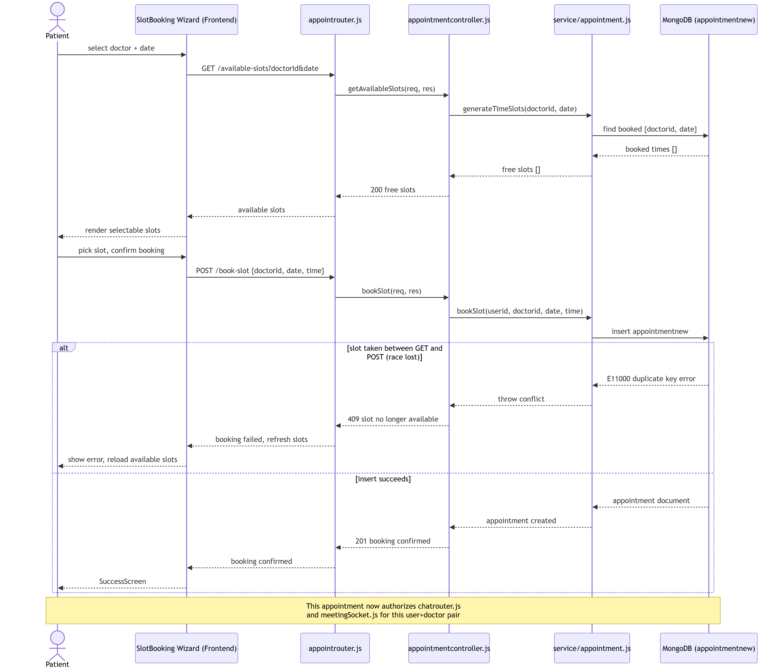

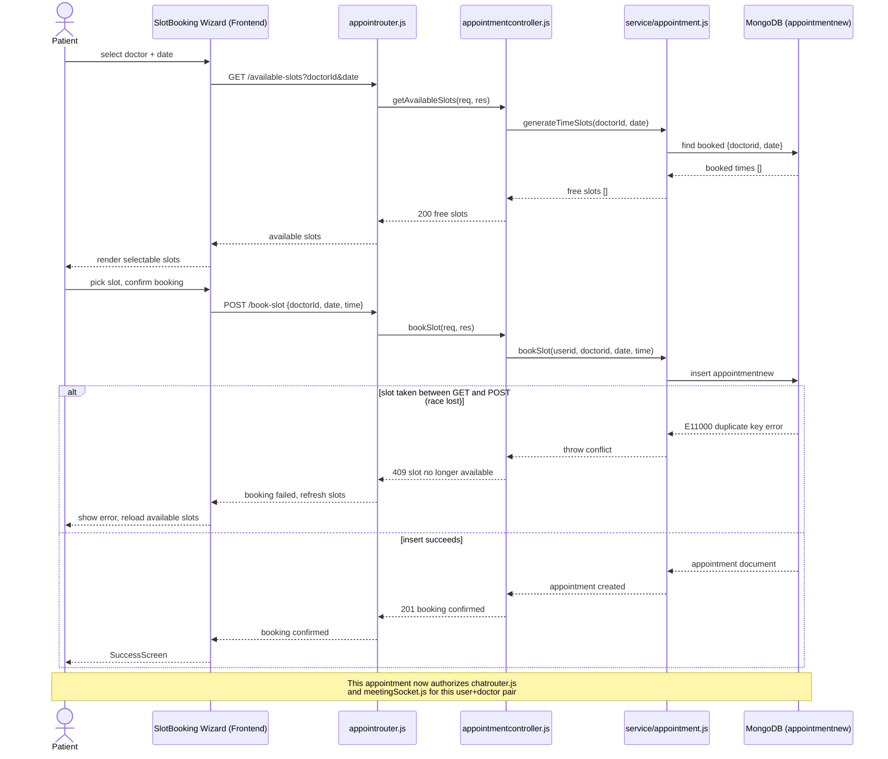

---

## 4. Class Diagram

The domain model as it's actually defined across `Backend/model/` — every attribute below is copied from the real Mongoose schemas, not inferred. `Doctor` and `DoctorPermission` are deliberately separate collections (`doctor` vs. `doctorpermissions`): a doctor only gets a `doctor` document once an admin approves their application, which is why the relationship between them is a dependency, not an association. `Report` is the one model with an actual Mongoose `ref` (`ReportMessage` is embedded, not referenced).

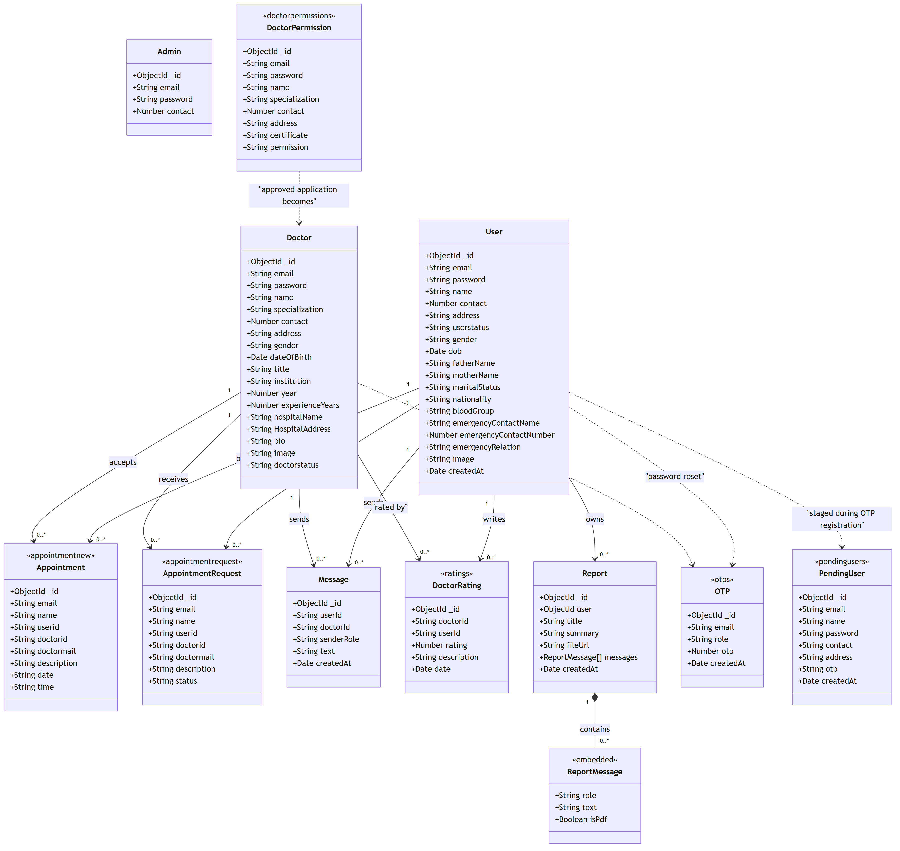

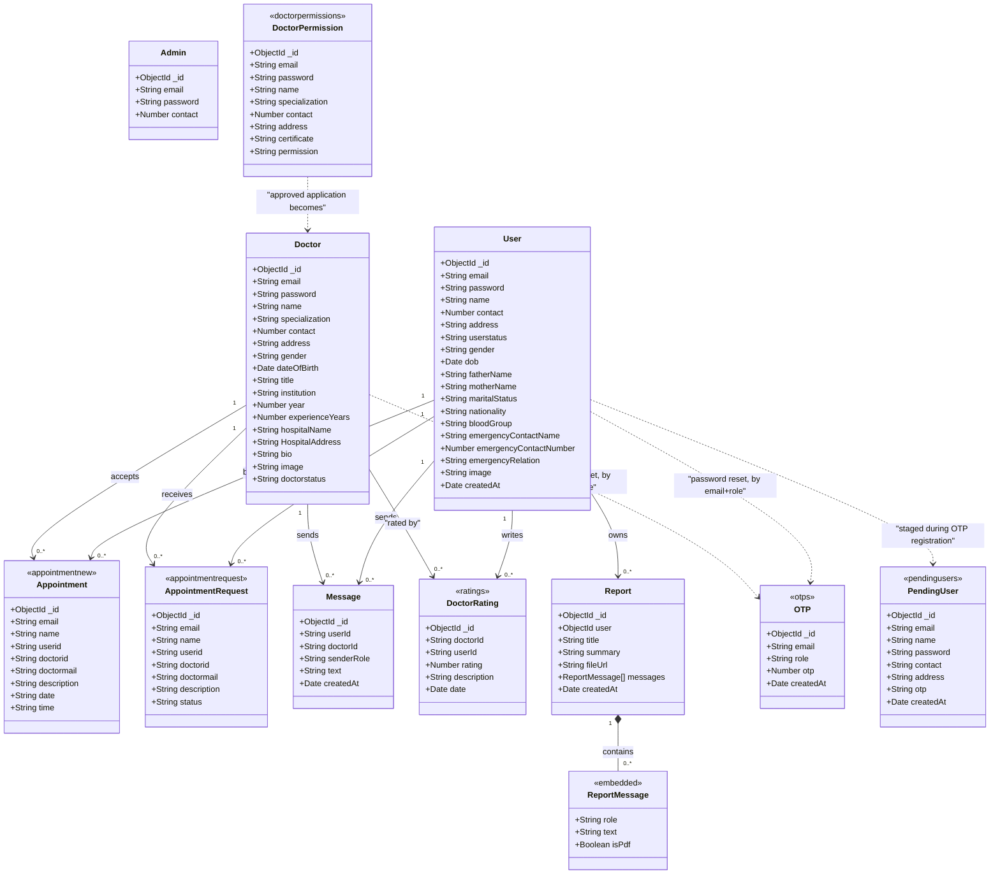

---

## 5. Component Diagram

Every feature module follows the same `Router → Controller → Service → Model` layering (as already noted in the README), except the bot/report/skin-analysis routers, which call their service directly. This diagram shows that layering plus every external component it talks to.


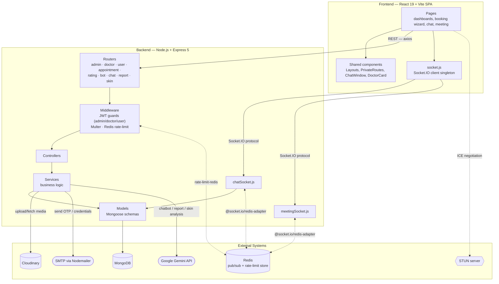

---

## 6. Deployment Diagram

The production topology from the README's [Horizontal Scaling](../README.md#horizontal-scaling--reverse-proxy) section, formalized as UML deployment nodes: two Dockerized backend instances behind Nginx on one VM, shared managed MongoDB/Redis, and the browser-to-browser WebRTC path that never touches the server.

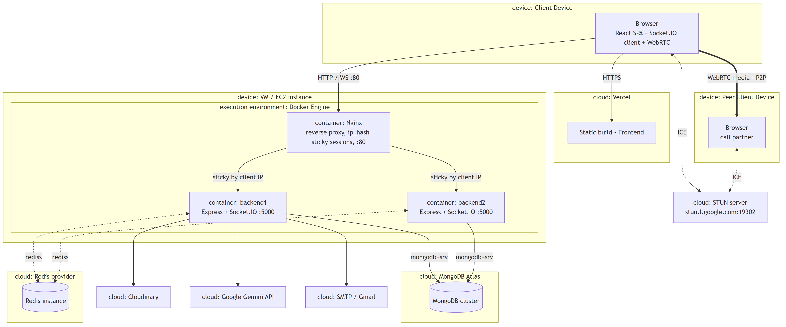

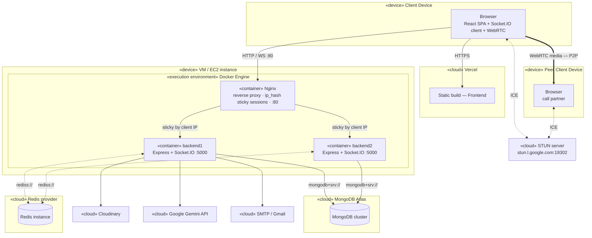

---

## 7. Communication Diagram

Real-time chat, drawn as a communication diagram: objects linked by association, with the interaction sequence numbered on each link rather than laid out on a timeline. This is the same feature as the chat sequence diagram in the README, viewed the other way — object topology first, message order second.

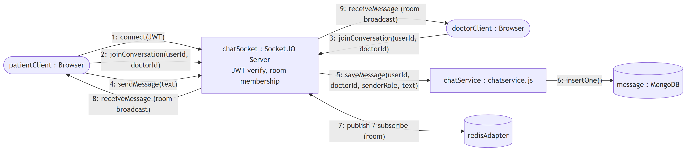

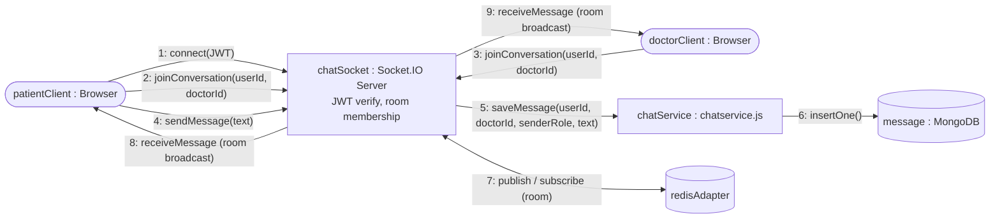

---

## 8. Object Diagram

A concrete runtime snapshot — one patient, one doctor, a confirmed appointment, two chat messages, and a rating — showing the same associations as the class diagram in [Section 4](#4-class-diagram), but instantiated with sample data instead of types.

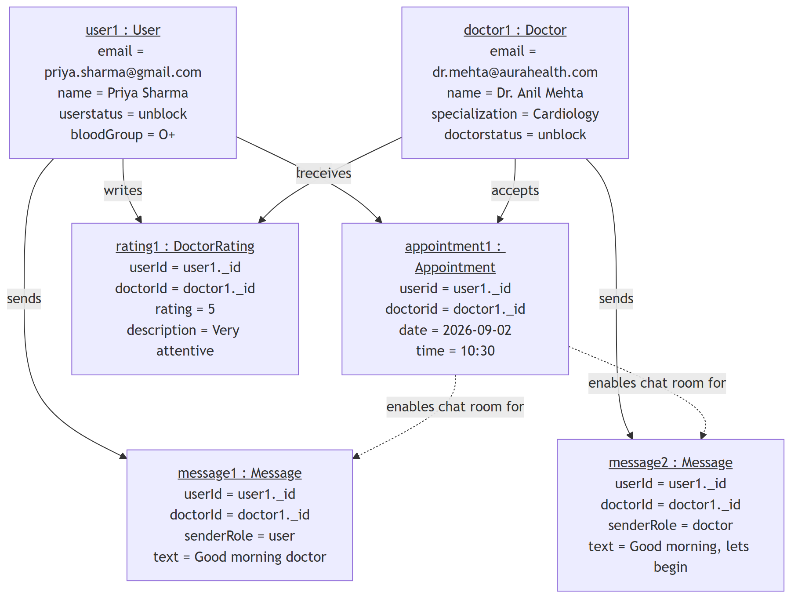

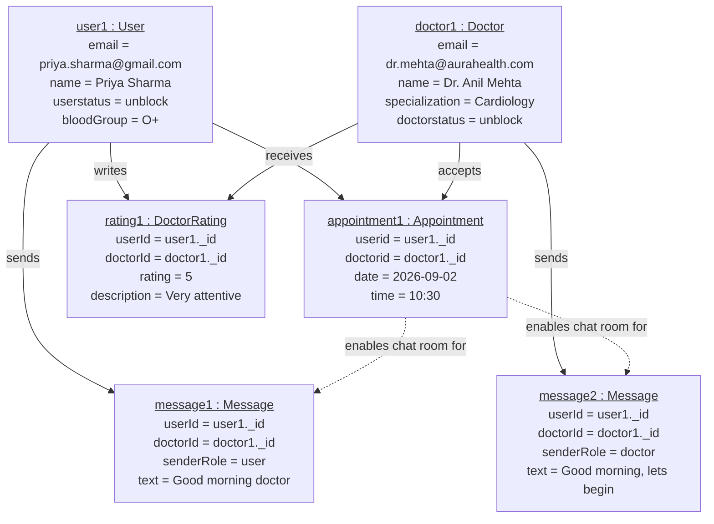
